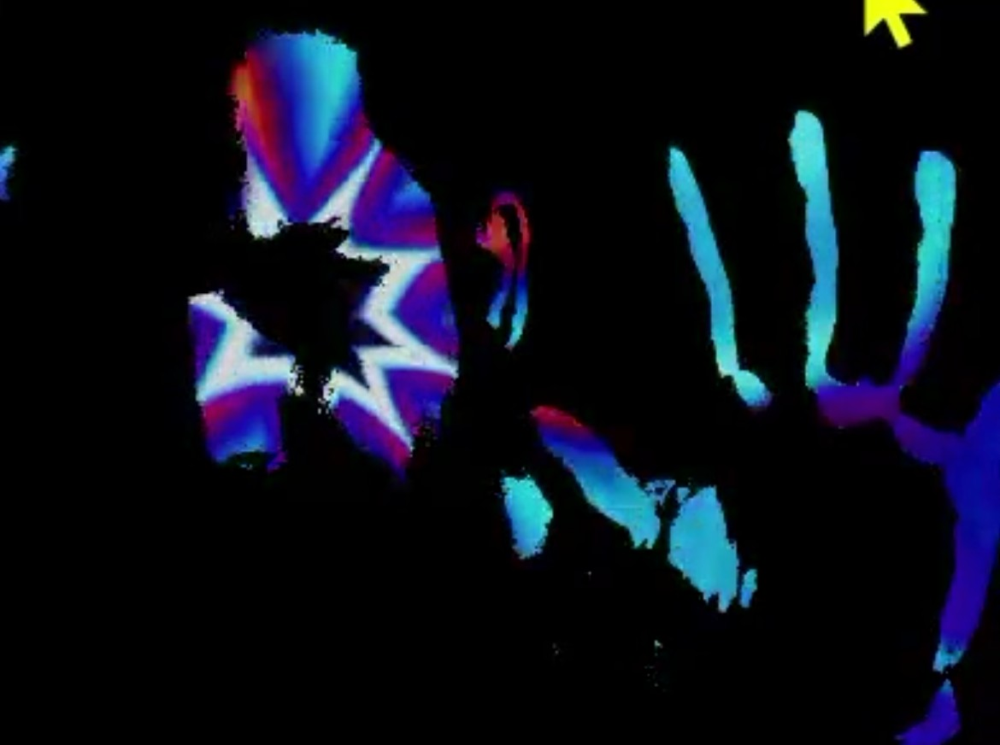

# Projection Mapper
Este projeto, criado para a disciplina Arte e tecnologia - Tecnoresistências e Multiculturalismo, ministrada pelo docente Paulo Cesar da Silva Teles na Unicamp, no segundo semestre de 2026.

# Sobre a proposta da obra
Ainda em estado experimental, a disciplina se propõe a criar obras coletivas. Atualmente a proposta decidida foi uma espécie de oficina, criando uma teia humana, relacionando artes cênicas, dança e artes visuais, com projeção mapeada nas pessoas. Atualização em breve!

# Sobre o aplicativo
Feito em Unity 6, a proposta é fazer um aplicativo próprio para a disciplina, de baixo custo, customizável, criado coletivamente e gratuito. A ideia inicial de funcionamento é criar um filtro aplicado ao vídeo captado em tempo real por uma câmera. Este filtro cria um limite de preto e branco, com a ideia de filtrar apenas o branco das roupas das pessoas em cena. Este filtro cria assim uma máscara nos vídeos do projeto.

# Como Usar
Utilize um computador, um projetor e uma câmera, de preferência uma câmera infravermelho. É possível hackear uma webcam simples para se tornar uma câmera infravermelho. Abra o projeto na Unity 6, ou o release para Windows. Coloque os seus vídeos na pasta "Videos" na raiz do projeto.

# Funcionalidades
- Pasta customizável de vídeos
- Cima / baixo - altera o limiar de PB
-  Esquerda / direita - Troca para o próximo vídeo

# Exemplo

